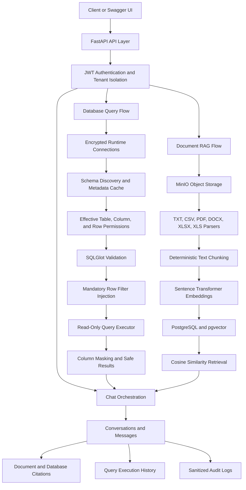

# Platform Architecture

## Security Boundaries

1. Every protected request requires a valid access token.
2. Tenant filters are applied to every tenant-scoped repository query.
3. Database credentials are encrypted at rest.
4. SQL is validated before and after mandatory row-filter injection.
5. Runtime SQL executes in a read-only transaction.
6. Results are limited, size-controlled, serialized, and masked.
7. Document retrieval is restricted by tenant and knowledge base.
8. API responses exclude storage keys, credentials, and embedding vectors.
9. Audit metadata is sanitized before persistence.